## Images

```mmd
gantt
  title Banking Sector - Investment Timeline
  dateFormat YYYY-MM-DD
  axisFormat %Y-%m-%d
  section HDFC Bank
  Strategy Implementation           :a1, 2025-01-01, 90d
  section ICICI Bank
  Digital Expansion                 :a2, 2025-02-15, 75d
  section SBI
  Rural Initiatives                 :a3, 2025-03-01, 60d
  section Axis Bank
  Corporate Lending                 :a4, 2025-03-15, 45d
  section Kotak Mahindra Bank
  Wealth Management                 :a5, 2025-04-01, 30d
```

Embedding images in Markdown.

Non existent image replaced by placeholder image.


SVG:


PNG:


Data URL:


## HTML Images

<p>
Here is an SVG image.
<svg xmlns='http://www.w3.org/2000/svg' xmlns:xlink='http://www.w3.org/1999/xlink' width='129' height='20' aria-label='downloads: 1.0M'><linearGradient id='b' x2='0' y2='100%'><stop offset='0' stop-color='#bbb' stop-opacity='.1'/><stop offset='1' stop-opacity='.1'/></linearGradient><clipPath id='a'><rect width='129' height='20' fill='#fff' rx='3'/></clipPath><g clip-path='url(#a)'><path fill='#555' d='M0 0h86v20H0z'/><path fill='#4c1' d='M86 0h67v20H86z'/><path fill='url(#b)' d='M0 0h129v20H0z'/></g><g fill='#fff' font-family='Verdana,Geneva,DejaVu Sans,sans-serif' font-size='110' text-anchor='middle' text-rendering='geometricPrecision'><image xlink:href='data:image/svg+xml;base64,PHN2ZyB4bWxucz0iaHR0cDovL3d3dy53My5vcmcvMjAwMC9zdmciIHZpZXdCb3g9IjAgMCA0MCA0MCI+PHBhdGggZD0iTTAgMGg0MHY0MEgwVjB6IiBmaWxsPSIjY2IwMDAwIi8+PHBhdGggZmlsbD0iI2ZmZiIgZD0iTTcgN2gyNnYyNmgtN1YxNGgtNnYxOUg3eiIvPjwvc3ZnPg==' width='14' height='14' x='5' y='3'/><text x='525' y='150' fill='#010101' fill-opacity='.3' aria-hidden='true' textLength='590' transform='scale(.1)'>downloads</text><text x='525' y='140' textLength='590' transform='scale(.1)'>downloads</text><text x='978' y='142' fill='#010101' fill-opacity='.3' aria-hidden='true' transform='scale(.11)'>1.0M</text><text x='968' y='135' transform='scale(.11)'>1.0M</text></g></svg>
</p>


## 10. Diagrams (Mermaid)

Visualizing data with diagrams.

### Flowchart


### Sequence Diagram

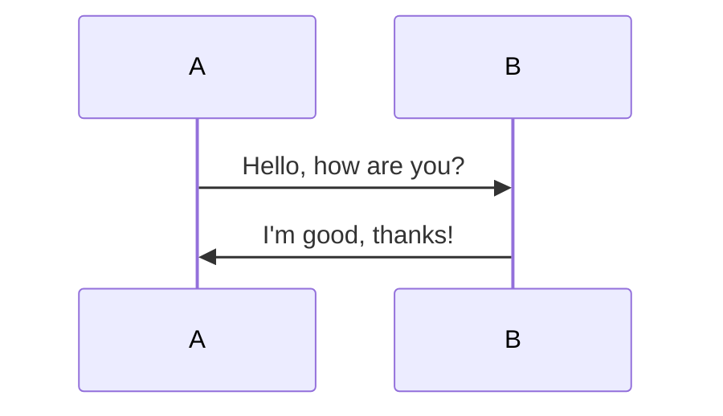

### Mindmap

```mindmap
- Root
  - Branch 1
    - Subbranch 1
    - Subbranch 2
  - Branch 2
    - Subbranch 3
    - Subbranch 4
```

### Chart (Gantt)

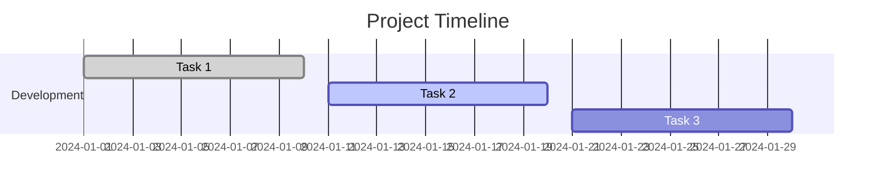

## 10. Diagrams (Mermaid)

Visualizing data with diagrams.

### Flowchart


### Sequence Diagram


### Mindmap

```mindmap
- Root
  - Branch 1
    - Subbranch 1
    - Subbranch 2
  - Branch 2
    - Subbranch 3
    - Subbranch 4
```

### Chart (Gantt)


# Mermaid Diagrams Showcase

## 1. Flowchart

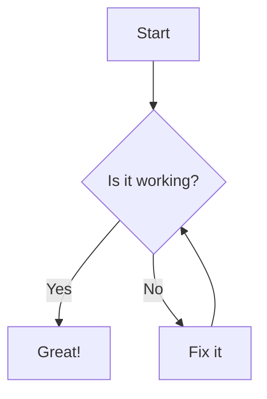

## 2. Sequence Diagram

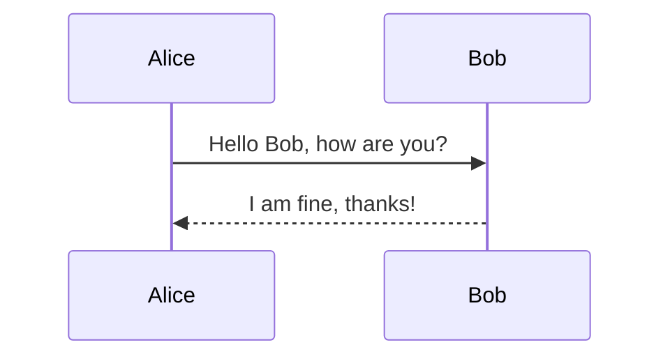

## 3. Class Diagram

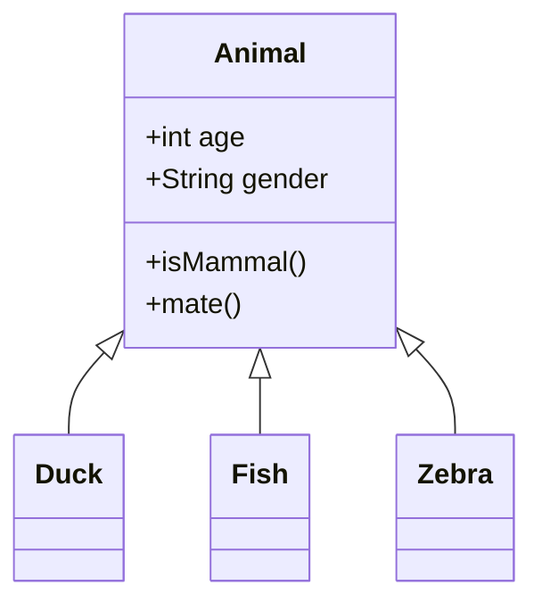

## 4. State Diagram

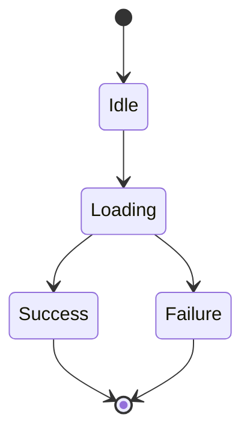

## 5. Gantt Chart

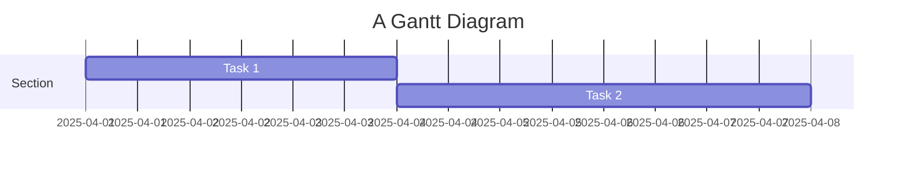

## 6. Pie Chart

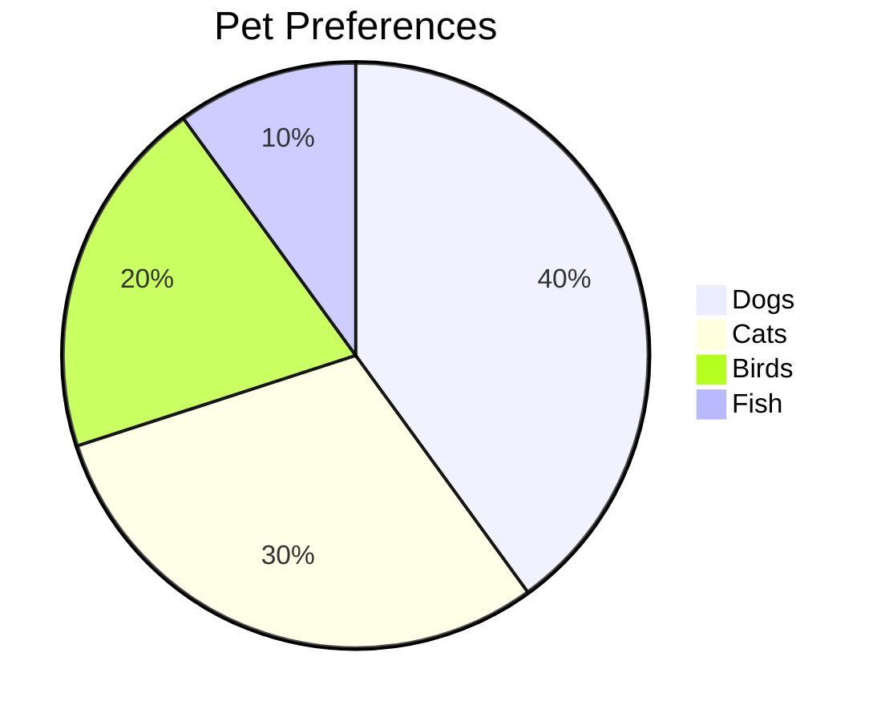

## 7. Git Graph

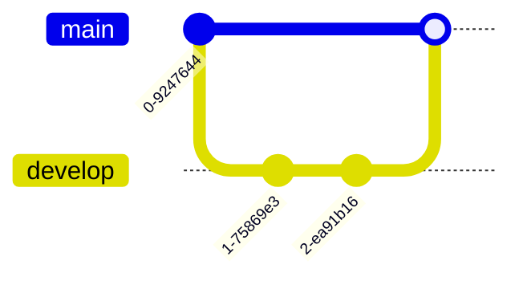

## 8. Entity Relationship Diagram (ERD)

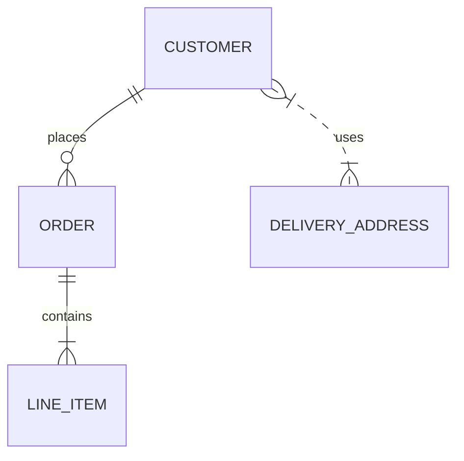

## 9. Journey Diagram

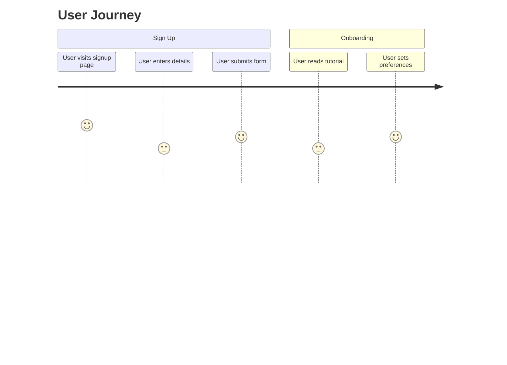

## 10. Requirement Diagram

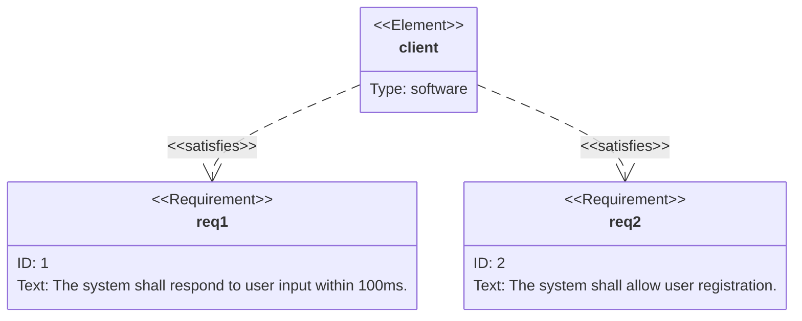

## 11. Mindmap

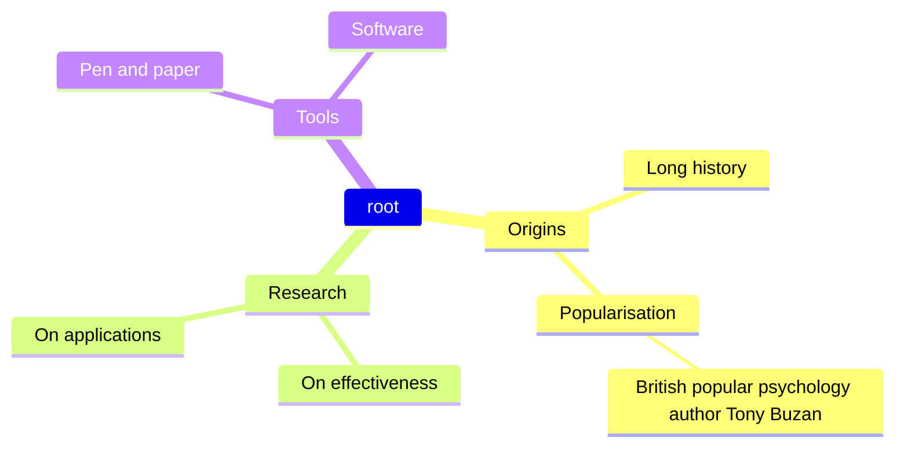

## 12. Quadrant Chart

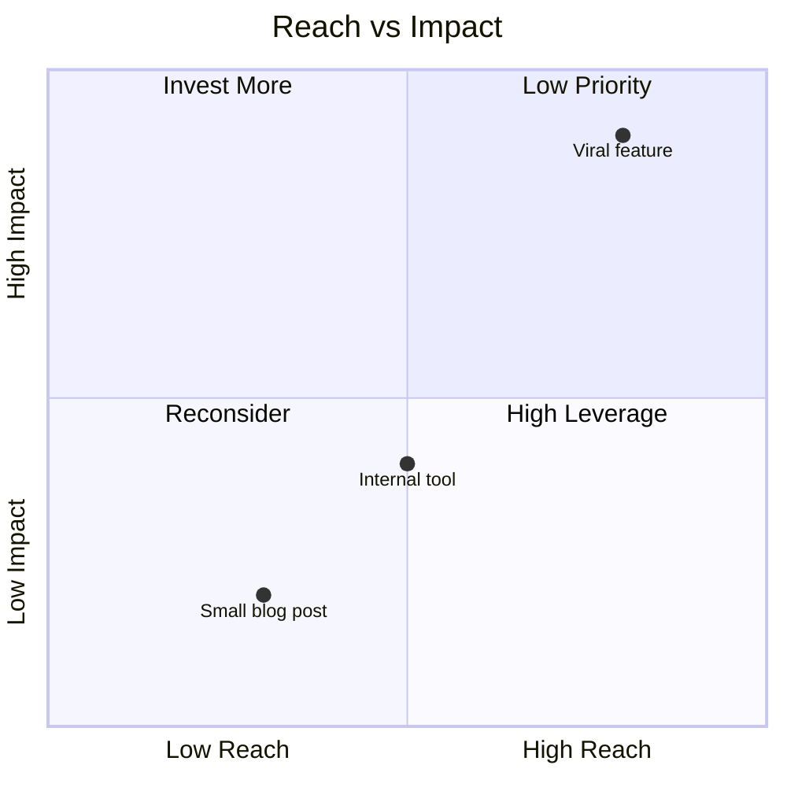
