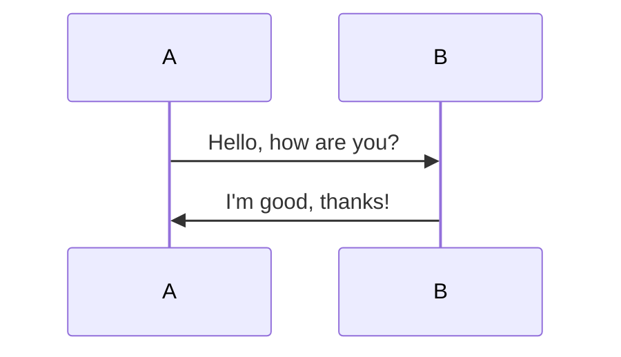
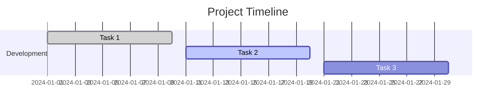

## Images

Embedding images in Markdown.

SVG:


PNG:


Data URL:


## 10. Diagrams (Mermaid)

Visualizing data with diagrams.

### Flowchart


### Sequence Diagram



### Mindmap

```mindmap
- Root
  - Branch 1
    - Subbranch 1
    - Subbranch 2
  - Branch 2
    - Subbranch 3
    - Subbranch 4
```

### Chart (Gantt)



## 11. Definition Lists

Defining terms and meanings.

Term 1  
: Definition 1

Term 2  
: Definition 2a  
: Definition 2b

## 12. Admonitions (Callouts)

Highlighting important notes or warnings.

> **Note:** This is an important note.
>
> **Warning:** Be careful with this step!

### HTML SVG Image

<p>
Here is an SVG image.
<svg xmlns='http://www.w3.org/2000/svg' xmlns:xlink='http://www.w3.org/1999/xlink' width='129' height='20' aria-label='downloads: 1.0M'><linearGradient id='b' x2='0' y2='100%'><stop offset='0' stop-color='#bbb' stop-opacity='.1'/><stop offset='1' stop-opacity='.1'/></linearGradient><clipPath id='a'><rect width='129' height='20' fill='#fff' rx='3'/></clipPath><g clip-path='url(#a)'><path fill='#555' d='M0 0h86v20H0z'/><path fill='#4c1' d='M86 0h67v20H86z'/><path fill='url(#b)' d='M0 0h129v20H0z'/></g><g fill='#fff' font-family='Verdana,Geneva,DejaVu Sans,sans-serif' font-size='110' text-anchor='middle' text-rendering='geometricPrecision'><image xlink:href='data:image/svg+xml;base64,PHN2ZyB4bWxucz0iaHR0cDovL3d3dy53My5vcmcvMjAwMC9zdmciIHZpZXdCb3g9IjAgMCA0MCA0MCI+PHBhdGggZD0iTTAgMGg0MHY0MEgwVjB6IiBmaWxsPSIjY2IwMDAwIi8+PHBhdGggZmlsbD0iI2ZmZiIgZD0iTTcgN2gyNnYyNmgtN1YxNGgtNnYxOUg3eiIvPjwvc3ZnPg==' width='14' height='14' x='5' y='3'/><text x='525' y='150' fill='#010101' fill-opacity='.3' aria-hidden='true' textLength='590' transform='scale(.1)'>downloads</text><text x='525' y='140' textLength='590' transform='scale(.1)'>downloads</text><text x='978' y='142' fill='#010101' fill-opacity='.3' aria-hidden='true' transform='scale(.11)'>1.0M</text><text x='968' y='135' transform='scale(.11)'>1.0M</text></g></svg>
</p>

You can also add **inline images**:


Or create **inline links** with styles:
